# UtwoA

`Python-first • Web • Telegram • Infra`

  
  
  

## /status

Building products at the intersection of backend, web and applied AI.

Telegram mini-apps, APIs, deploy, CI/CD and production support.

## /now

- Python backend and integrations
- Telegram bots and mini-apps
- Deploy, VPS ops, CI/CD
- Practical ML/AI in product workflows

## /stack

- `main` → Python core / API architecture / project foundation
- `feat/frontend` → HTML / CSS / JavaScript / TypeScript / responsive UI
- `feat/backend` → FastAPI / Django / Flask / REST API / integrations
- `feat/ml-ai` → NumPy / Pandas / scikit-learn / feature engineering
- `feat/data` → SQL / PostgreSQL / SQLite / Redis / ETL
- `feat/devops` → Linux / Docker / Nginx / CI/CD / WireGuard / VPS ops
- `release/fullstack` → frontend + backend + ML + infra

## /proof

  
  

## /selected

- `utwoa.ru` — portfolio and proof layer
- Telegram products — mini-apps, bots, private-access tooling
- Backend delivery — APIs, integrations, automation
- Applied ML / data — preprocessing, experiments, practical workflows

## /links

- Site — https://utwoa.ru
- Telegram — https://t.me/UtwoA
- GitHub — https://github.com/UtwoA
